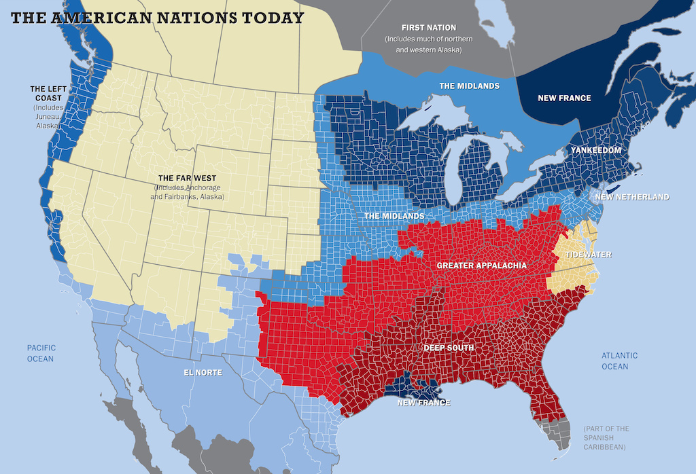

#Mapping America's Behaviors Towards Human Mortality
##Final Project for [Data Representation](http://itp.blprnt.com/), ITP, 2013.12

###About this Project

Inspired by [this article](http://www.tufts.edu/alumni/magazine/fall2013/features/up-in-arms.html) published Fall 2013 in Tufts University Alumni Magazine, I decided to conduct a data study to determine if there is data-based discernible pattern for regional attitudes towards health and human mortality.

The red borders define "The American Nations of Today" as demarcated in [the article](http://www.tufts.edu/alumni/magazine/fall2013/features/up-in-arms.html) (below): 

The data sets (as outlined below) were selected from the [CDC's Behavioral Risk Factor Surveillance System](http://www.cdc.gov/brfss/). This study is: 

###Methodologies

###Technologies

###Data Sets Used

The data sets (as outlined below) were selected from the [CDC's Behavioral Risk Factor Surveillance System](http://www.cdc.gov/brfss/).

> In 1984, the Centers for Disease Control and Prevention (CDC) initiated the state-based Behavioral Risk Factor Surveillance System (BRFSS)--a cross-sectional telephone survey that state health departments conduct monthly over landline telephones and cellular telephones with a standardized questionnaire and technical and methodologic assistance from CDC. BRFSS is used to collect prevalence data among adult U.S. residents regarding their risk behaviors and preventive health practices that can affect their health status.

* [Binge drinking: adults (percent) (Source: BRFSS)](http://www.healthindicators.gov/Indicators/Binge-drinking-adults-percent-Source-BRFSS_17/Profile)
* [Cigarette smoking: adults (percent) (Source: BRFSS)](http://www.healthindicators.gov/Indicators/Cigarette-smoking-adults-percent-Source-BRFSS_13/Profile)
* [Excessive drinking: adults (percent) (Source: BRFSS)](http://www.healthindicators.gov/Indicators/Excessive-drinking-adults-percent-Source-BRFSS_150/Profile)
* [Fair or poor health: adults (percent)](http://www.healthindicators.gov/Indicators/Fair-or-poor-health-adults-percent_5/Profile)
* [No exercise: adults (percent) (Source: BRFSS)](http://www.healthindicators.gov/Indicators/No-exercise-adults-percent-Source-BRFSS_120/Profile)
* [Obesity: adults (percent) (Source: BRFSS)](http://www.healthindicators.gov/Indicators/Obesity-adults-percent-Source-BRFSS_15/Profile)
* [Social-emotional support lacking: Adults (percent)](http://www.healthindicators.gov/Indicators/Social-emotional-support-lacking-Adults-percent_50028/Profile)
* 
